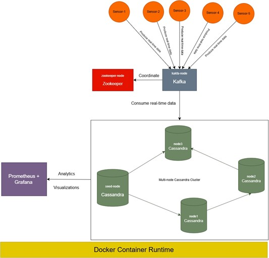

# **Distributed Analytics Platform Using Apache Cassandra**
This project implements a **scalable, fault-tolerant, and high-throughput distributed analytics platform** for IoT sensor data using **Apache Cassandra, Apache Kafka, Docker, Prometheus, and Grafana**. The system ingests real-time sensor data, processes it through Kafka, and stores it in Cassandra for efficient querying and analytics.

## **1. Features**
- 🚀 **Scalability**: Multi-node Cassandra cluster designed for large-scale IoT data.
- 🔄 **Fault Tolerance**: Data replication ensures system reliability.
- ⚡ **Real-Time Data Ingestion**: Kafka producer-consumer pipeline for sensor data processing.
- 🔍 **Optimized Query Performance**: Using partitioning, clustering keys, and materialized views.
- 📊 **Monitoring & Visualization**: Real-time monitoring with Prometheus and Grafana.

## **2. System Architecture**
The system consists of the following core components:

1. **Apache Cassandra** – NoSQL database for high-throughput data storage.
2. **Apache Kafka** – Message queue for real-time data streaming.
3. **Zookeeper** – Manages Kafka broker coordination.
4. **Prometheus** – Collects and monitors system metrics.
5. **Grafana** – Visualizes performance metrics.

### **Architecture Diagram**


## **3. Setup Instructions**

### **Prerequisites**
Ensure you have the following installed:
- **Docker & Docker Compose**
- **Python 3.x**
- **Kafka Python Client (`confluent_kafka`)**
- **Cassandra Python Driver (`cassandra-driver`)**

## **4. Data Model**
```bash
CREATE KEYSPACE IF NOT EXISTS sensor_data_schema
WITH replication = {
    'class': 'SimpleStrategy',
    'replication_factor': 3
};

CREATE TABLE iot_sensor_metrics (
    location TEXT,
    device_type TEXT,
    iot_sensor_id UUID,
    recorded_timestamp TIMESTAMP,
    temperature FLOAT DEFAULT -999.0,
    humidity FLOAT DEFAULT -999.0,
    pressure FLOAT DEFAULT -999.0,
    motion_detected BOOLEAN DEFAULT false,
    light_level INT DEFAULT 0,
    gas_concentration FLOAT DEFAULT -999.0,
    other_metrics MAP<TEXT, FLOAT> DEFAULT {},
    PRIMARY KEY ((location, device_type), iot_sensor_id, recorded_timestamp)
  );
```
## **5. Running the Kafka Producer & Consumer**
Run the Producer: Simulates IoT sensor data and publishes messages to the Kafka topic (iot-analytics-topic).
bash
```
python producer.py
```
Run the Consumer: Reads data from Kafka and writes processed data into Cassandra.
bash
```
python consumer.py
```
## **6. Querying Data**
- Basic queries
- Advanced Queries - Identify sensors with extreme values

## **7. Monitoring with Prometheus & Grafana**
- Start Monitoring Services
- Access Grafana Dashboard
- Open http://localhost:3000 in a browser and configure Prometheus as a data source.
- Available Metrics
  Cassandra: Query latency, node health.
  Kafka: Consumer lag, topic throughput.
  System Metrics: CPU, memory usage.

## **8. Scaling the System**
- Add a Cassandra Node
- Decommission a Node
  
## **9. Future Enhancements**
- Implement Machine Learning for predictive analytics.
- Add Time-to-Live (TTL) for automatic data expiration.
- Integrate Apache Spark for batch analytics.
